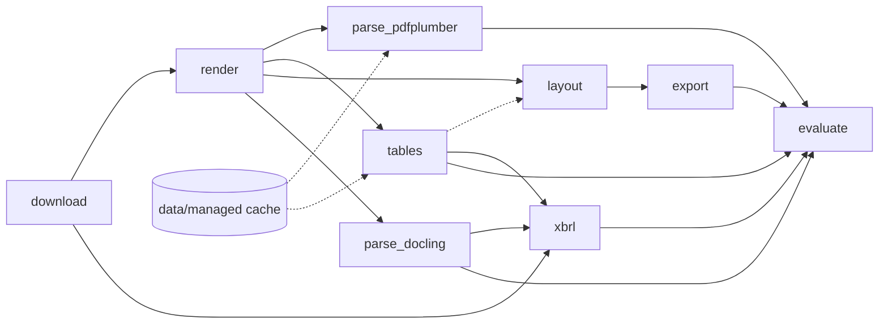

# Project LANTERN - Case Study 1 (DAMG 7245, Fall 2026)

A reproducible pipeline that turns SEC 10-K/10-Q filings into a layout-aware, XBRL-validated
corpus (Markdown + JSONL with page/bbox provenance), versioned end-to-end with DVC.
Team: codeofduty3. Company: AKAM (Akamai Technologies) - one 10-K and one 10-Q filed 2024-01-01..2026-01-01 (pinned in `params.yaml`).

- Codelab: `<link>`
- Demo video (10 min): `<link>`
- DVC remote: see [DVC remote access](#dvc-remote-access)

## Architecture



| Stage | Script | Output |
|---|---|---|
| download | `src/download.py` | `data/raw/` filings, `unpacked/` iXBRL + .xsd + linkbases, companyfacts |
| render | `src/render.py` | `data/rendered/{TICKER}_{FORM}_{PERIOD}.pdf`, `manifest.csv` |
| parse_pdfplumber | `src/parse_text.py` | `data/parsed/{stem}_p{NNNN}.txt`, `{stem}.words.jsonl`, `ocr_log.csv` |
| tables | `src/tables.py` | `data/tables/*.raw.csv / *.cells.csv / *.clean.csv`, `tables_log.csv` |
| layout | `src/layout.py` | `data/layout/{stem}.blocks.jsonl`, `data/figures/` |
| parse_docling | `src/docling_parse.py` | `data/docling/` (md, json, per-page md, tables, prov) |
| export | `src/export.py` | `data/export/{stem}.jsonl/.md/.txt` |
| xbrl | `src/xbrl.py` | `data/xbrl/facts.csv`, `comparison.csv` |
| evaluate | `src/evaluate.py` | `reports/metrics.json`, `reports/eval.md`, `reports/plots/drift.png` |

## Map from each Part to code and reports

| Part | Code | Report / deliverable |
|---|---|---|
| 0 Bootstrap | `src/download.py`, `src/render.py`, `src/make_fixtures.py` | `data/rendered/manifest.csv`, `tests/fixtures/` |
| 1 Text + OCR | `src/parse_text.py` | `data/parsed/`, OCR thresholds in `params.yaml` (ocr) |
| 2 Tables | `src/tables.py`, `src/bakeoff.py` | `reports/tables_method.md`, `reports/handcheck/` |
| 3 Layout | `src/layout.py` | `reports/layout/`, `reports/layout_audit.md` (+ `.csv`) |
| 4 Docling | `src/docling_parse.py` | `reports/docling_comparison.md` |
| 5 Metadata | `src/schema.py`, `src/export.py` | `data/export/{stem}.jsonl`, `.md` |
| 6 Formats | `src/export.py` | `reports/format_decision.md` |
| 7 Build vs buy | `src/managed/` | `reports/build_vs_buy.md`, `data/managed.dvc` |
| 8 DVC + CI | `dvc.yaml`, `.github/workflows/smoke.yml` | `dvc.lock` |
| 9 Evaluation | `src/evaluate.py`, `tests/test_quality.py` | `reports/eval.md`, `reports/metrics.json`, `reports/plots/drift.png` |
| 10 Benchmarks | `src/bench.py` | `data/bench/*.csv`, `reports/benchmarks.md` |
| 11 XBRL | `src/xbrl.py`, `config/label_map.yaml`, `notebooks/xbrl_validation.ipynb` | `reports/xbrl.md` |

Part 10 is run separately from `dvc repro` because model loading and timings are hardware-
dependent. After rendered PDFs are available (for example, after `dvc pull`), run:

```bash
python src/bench.py
```

This samples up to 100 evenly spaced pages per stage, in a fresh process per stage, and writes
per-page timings/status/RSS observations to `data/bench/*.csv`. The table stage samples only
numeric table-candidate pages; if fewer than 50 exist, the report records that shortfall instead
of padding the sample. The cost report uses the explicitly stated 5,000-filings/year and
100-pages/filing assumptions; benchmark data is machine-specific. The full stage list requires
the layout dependencies from `requirements-colab.txt`; benchmarking remains separate from
`dvc repro`.

Reports have a generated block (between `AUTO:START/END`, rewritten by the scripts) and a
Discussion section written by the team, which the scripts never touch.

## Setup (once)

System packages: Tesseract (`brew install tesseract` / `apt install tesseract-ocr`), Poppler
(`brew install poppler` / `apt install poppler-utils`). Camelot >= 1.0 renders with pypdfium2,
so Ghostscript is not required.

The layout stage fetches its detector weights into `data/models/` on first run from the
pinned URL in `params.yaml` (layoutparser's own catalog points at deleted Dropbox files) and
checks the sha256 before use. On Intel macOS the newest PyTorch wheel is 2.2.2, which needs
the NumPy 1.x ABI, so `requirements.txt` holds `numpy`, `opencv-python` and `transformers`
back for `darwin`/`x86_64` only; on other platforms the normal versions apply.

```bash
python3.11 -m venv .venv && source .venv/bin/activate
pip install -r requirements.txt
playwright install chromium        # only needed to re-run render / make_fixtures
```

## Reproduction (grader contract)

```bash
git clone <your-repo> lantern && cd lantern
git checkout submission
python -m venv .venv && source .venv/bin/activate
pip install -r requirements.txt
dvc pull
dvc repro            # managed.enabled: false -> no credentials needed
dvc metrics show
pytest -q
```

After `dvc pull`, `dvc repro` restores or skips every stage; a second `dvc repro` skips all.

## DVC remote access

Remote `storage` is an S3 bucket with public read on the project prefix. Graders need no
credentials (`allow_anonymous_login`). Team members push with their own AWS credentials from
the environment (never committed).

```bash
dvc remote list          # storage  s3://damg7245-codeofduty3/lantern (default)
dvc pull                 # anonymous read
```

To *push*, two one-time local steps are required. The committed
`allow_anonymous_login = true` is what lets graders read without credentials, but it also
makes DVC sign writes anonymously, so publishing fails with `Access Denied` until each
pusher overrides it locally (the override is written to `.dvc/config.local`, which is
gitignored, so it never reaches the repo):

```bash
dvc remote modify --local storage allow_anonymous_login false
dvc push
```

If your credentials come from `aws login` (`login_session` in `~/.aws/config`), boto3 also
needs the CRT extra inside the venv or the push stops with
`Missing Dependency: ... pip install "botocore[crt]"`:

```bash
pip install "botocore[crt]"
```

## Expected run times (CPU, from reports/benchmarks.md)

| Stage | Time for both filings |
|---|---|
| download + render | ~2 min (network) |
| parse_pdfplumber | `<fill>` |
| tables | `<fill>` |
| layout | `<fill>` (first run downloads model weights) |
| parse_docling | `<fill>` (first run downloads models) |
| export, xbrl, evaluate | `<fill>` (Arelle fetches the US-GAAP taxonomy once) |

## Manual inputs (made by the team, versioned)

- `reports/handcheck/*.csv` - 10 cells per statement page, typed from the PDF page.
- `data/ground_truth/` - `strata.csv`, page transcriptions and statement CSVs (from page images:
  `python src/evaluate.py --render-gt`); fixture copies in `tests/fixtures/gt/`.
  Conventions: `tests/fixtures/gt/CONVENTIONS.md`.
- `reports/layout_audit.csv` - correct / missed / wrong type per class on 10 pages.
- `data/managed/` - Textract responses from `python src/managed/compare.py --call-api`
  (tracked with `dvc add data/managed`).

## Generative AI disclosure

`<Declare, per the course policy, which tools were used and for what.>`

## Attestation

WE ATTEST THAT WE HAVEN’T USED ANY OTHER STUDENTS’ WORK IN OUR ASSIGNMENT AND ABIDE BY
THE POLICIES LISTED IN THE STUDENT HANDBOOK.

- Member 1: __ %
- Member 2: __ %
- Member 3: __ %
